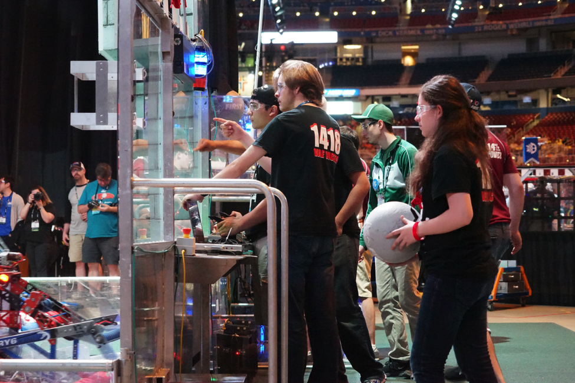
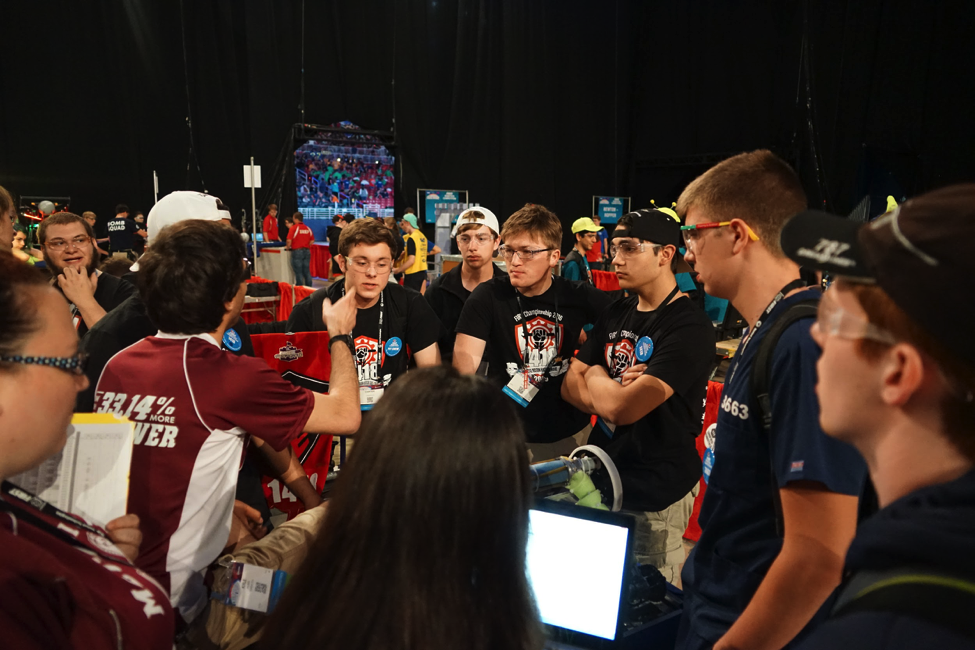
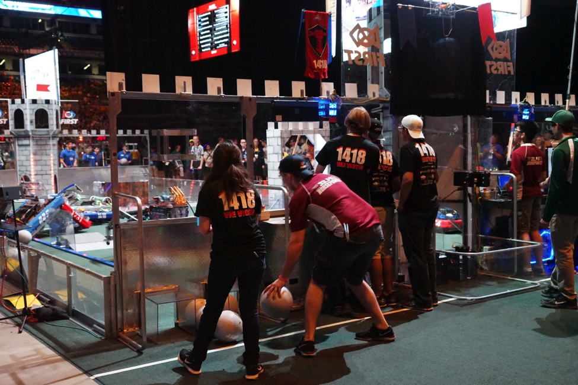
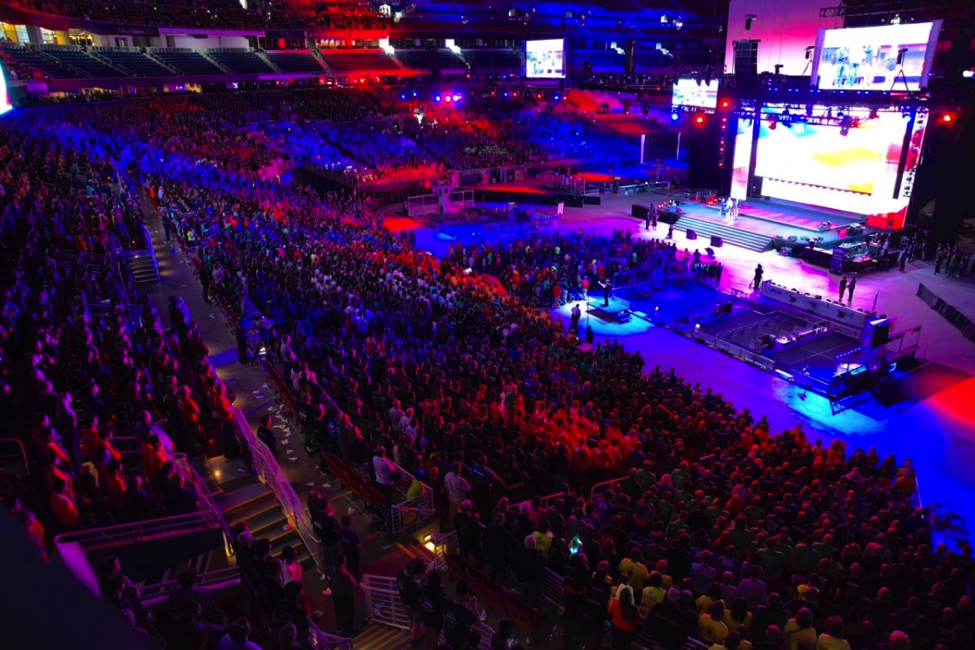

The most successful season in the history of George Mason High School’s Robotics team is in the books. Team 1418 finished in 12th placed and ended up captaining the 8th-seeded alliance at the World Championships in St. Louis, Missouri, over the weekend of April 27-30.

The team had a record-setting season overall, winning first place in the roboticsworld1Washington DC and Bethesda district competitions, then advancing to and winning the FIRST Chesapeake Tri-state Regional Competition. The team additionally won the Innovation in Control award twice for their innovative web-based dashboard control system, and the Industrial Design award for their powerful and remarkably consistent tower-climbing arm.

After winning first at Regionals, the team advanced to the World Championship for the first time since 2010.

“The championship was a amazing event,” said junior Carder Fendley. “It was amazing to see how far we were able to push our robot’s abilities. This season we have taken the team further then ever before. Hopefully in years to come we can continue to push the limits of what 1418 can do.”

At the World competition, Team 1418 faced numerous technical difficulties in the initial qualifying rounds, but managed to make it up to 12th place and become captain of the 8th seeded alliance.

The tournament proved to be challenging, fun, and above all a great learning experience.

“Worlds allowed me to expand my horizons in more ways than one,” said Rachel Baek, junior.  “I was able to speak with teams from Mexico, Korea, Israel, and Iraq… Being placed in the Newton division, the most competitive district at the competition, really brought out the best in the entire team. I feel that I was able to improve upon my communication skills and people skills. Being given the opportunity to collaborate with teams from all over the world allowed me to broaden my horizons in engineering as well as gain different perspectives on the world of STEM… I had an incredible time at worlds and I hope to be able to make it there next year as well.”

roboticsworld3In the tournament, the team chose an alliance including Team 3663 “CPR” from Bothell, Washington, and 3314 “Mechanical Mustangs” from Clifton, New Jersey, and team 229 “Division by Zero,” from Potsdam, New York.

However, facing fierce opposition in the first round from team 254 “The Cheesy Poofs” from San Jose, California, 1241 “THEORY6” from Mississauga, Ontario, team 708 “Hatters Robotics” from Horsham, Pennsylvania, and team 1731 “Fresta Valley Robotics,” from Marshall, VA. 254 and 1241 have both won world championships in the past, and proved to be a formidable opponent when they scored two victories over 1418’s alliance, ending the team’s season.

However, 1418 members were not discouraged, as the team had never gotten this far in all the 12 years of its existence, and no current members had ever had the chance to attend worlds.

The team’s robot driver Tim Winters, a senior who will be leaving for college next year, said it best:

“I’m very glad I ended my high school robotics career this way. After 4 years of getting close but not far enough, making it to worlds was a well deserved experience. I hope those of us who will be here next year learned a lot and carry the ideas and processes they learned into next season. I am confident we will do even better next year.”
