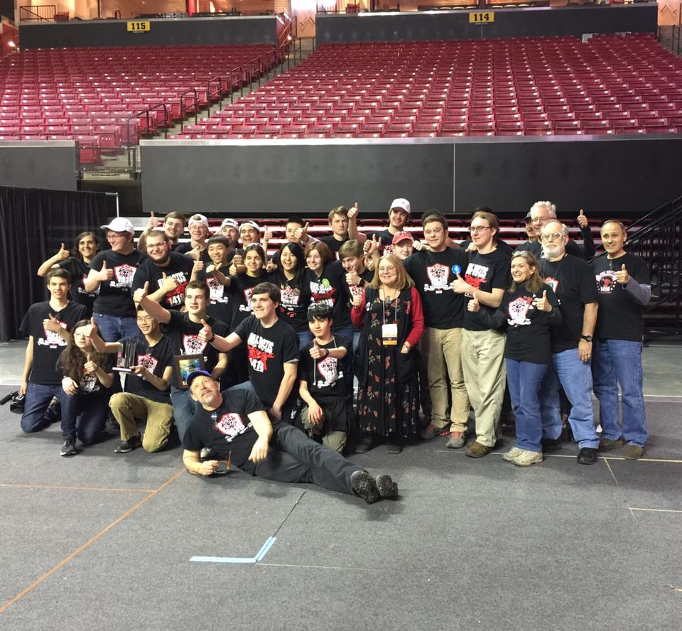
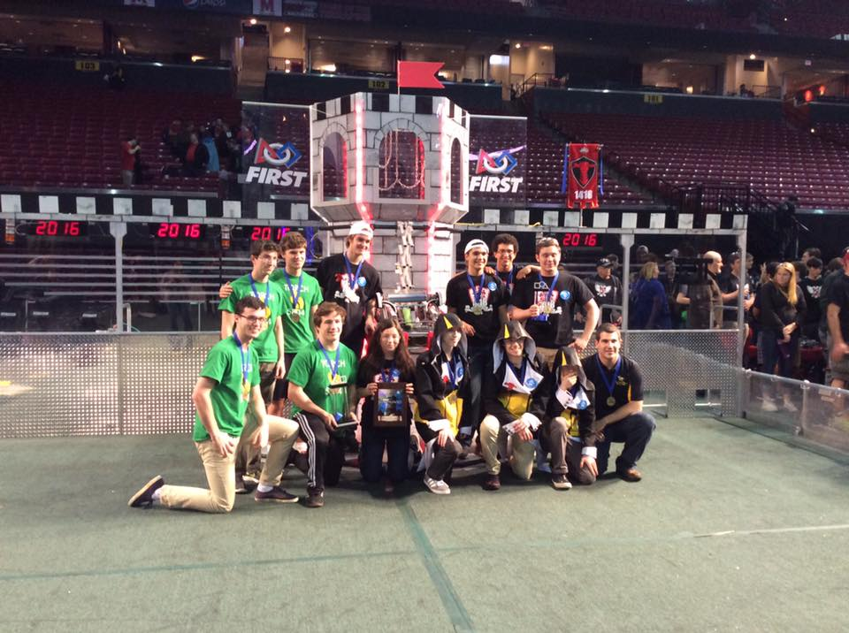
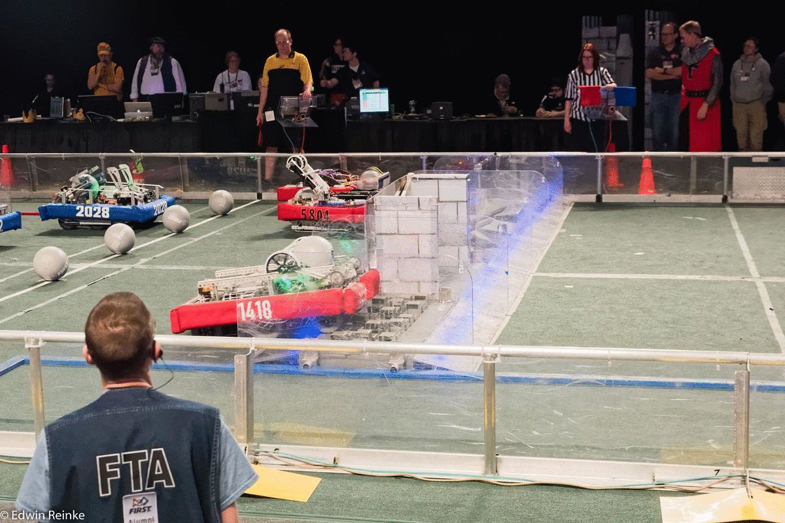

The weekend of April 7-9 was quite possibly one of the most exciting weekends in the history of George Mason’s robotics Team 1418 “Vae Victis.”

Against 57 other top teams from all over Virginia, Maryland, Delaware, and Washington DC,
The Mustangs achieved a major victory at the Chesapeake District Championship. With the win, Team 1418 qualified for the FIRST World Championships April 27-30 in St. Louis.

Said junior Rachel Baek: “To be honest, I didn't expect to win. It was the best surprise ever because for the past few years we have been so close to winning, but were never quite able to make it to worlds. When the final scores and rankings were released, I was so incredibly happy. I’m thrilled that we’ve finally accomplished our dreams of making it to the world competition. I'm so proud of my team.”

Junior Camille Borja echoed those sentiments, adding, “It was an amazing experience to work with all these different teams from around our region. I was amazed at how every robot’s design was so distinct, even though we were playing the same game. I am looking forward to seeing new game strategies and working with more teams in our final competition."

Photo: Melissa Rogers

In the initial qualifying rounds, 1418 shot up to first place and remained there for most of the qualifying rounds, up until match 60, which was against three other high-scoring teams: team 1413 “Skrappy’s Zoo” from Skipwith, VA, team 836 “The RoboBees” from Hollywood, MD, and team 1086 “Blue Cheese” from Glenn Allen, VA.

1418 and the rest of the alliance lost that round and the next one, 68. The combined losses were enough to remove George Mason’s team from its comfortable position in first, and the team spent the remaining matches struggling for first place.

“We were really flying high then, but we looked at our upcoming matches and thought, ‘Oh no, that’s an awful matchup.’ Turns out we were right to worry. But in the end, it turned out alright,” said junior Bowei Lin.

In the final qualifying match, the team managed to regain first place by a narrow margin of two ranking points.

During the alliance selection process, team 1418 chose to ally with team 836 “The RoboBees,” from Hollywood, MD and rookie team 5804 “Torch” from Richmond. These teams were carefully chosen by many of the team members after extensive, careful analysis of each team’s strengths and weaknesses.

Photo: Sia Nowrojee

Initially, 1418’s robot experienced issues with its climbing arm and defensive measures by enemy alliances. The team was scoring consistently less points than alliances in other matches, and eventual defeat seemed inevitable. However, the team eventually got the climbing arm to work more consistently, which allowed the alliance to score significantly higher.

The main expected challenge to a win was the alliance which was created by the second place team, Team 339 “Kilroy Robotics,” from Stafford, Virginia. However, that alliance experienced mechanical issues, and one of their alliance’s robots (1413) flipped completely over, destroying most of their alliance’s scoring potential. This mishap, combined with a previous loss, was enough to take them out of the running.

1418’s alliance then competed against the sixth-seeded alliance, which beat Kilroy’s alliance. This alliance was composed of teams 346 “RoboHawks” from Chesterfield, VA, 422 “Mech Tech Dragons” from Richmond, and 1262 “The STAGS” from Martinsville, VA. In the first competition, team 1418’s alliance defeated these opponents 155 to 112.

“We were surprised when the sixth seated alliance beat the second, and also pretty excited, because it was unlikely that a lower-ranked set of teams would be able to beat us,” said team artist Aki Maher.

Before the second round, team 346 experienced communication problems, which prompted the alliance to summon a fourth team as a replacement. After a delay, team 1137 “Rocket Sauce” from Matthews, VA was called in to complete the final match.

In the final match, 1418’s alliance defeated their opponents 160-147. As playoff rounds are won on a 2 out of 3 basis, this secured 1418’s win along with their alliance partners team 836 and 5804.

In addition to taking first place, team 1418 also took home a second Innovation in Control award for their web-powered User Interface, designed and developed by freshman Erik Boesen and senior Leon Tan.

“The championship finals were an amazing exhibition of design and strategy. Our robot design proved to be durable, consistent, and always a work in progress,” said mentor John Ballou in an email to FCCPS faculty.

Photo: Edwin Reinke

You can keep up with team 1418 on [the team’s Facebook](https://gmhslasso.org/2736/news/1418-scores-major-tri-state-victory/).

